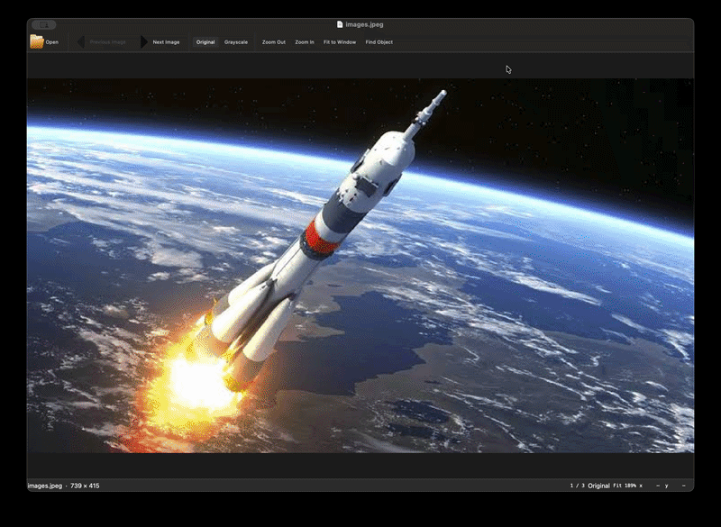

<div align="center">

# Pixel Viewer

**A fast, native image viewer that shows the value of every pixel as you zoom in.**

Built for inspecting renders, datasets and segmentation masks: zoom into any region and read the exact
R, G, B (or grayscale) value of each pixel, then flip through the rest of the folder with the arrow keys
without losing your place.

[](https://github.com/mustachemo/pixel-viewer/actions/workflows/ci.yml)
[](https://github.com/mustachemo/pixel-viewer/releases/latest)
[](https://www.python.org/)
[](#installation)
[](LICENSE)

<br>



</div>

## Features

- **Per-pixel values.** A pixel grid appears at 8×. Values appear at 24× in grayscale, and at 32× as R, G and B
  in red, green and blue.
- **Folder browsing.** **←** / **→** step through every image in the folder in natural order (`img_2` before
  `img_10`). Zoom and position stay put, so you can compare the same spot across frames. Nearby images are decoded
  in the background, so switching is instant.
- **Made for masks.** Images whose channels are identical collapse to one value per pixel. Label masks (up to 64
  distinct IDs) get a fixed color per ID that stays the same in every frame.
- **Native and fast.** Qt with native menus, trackpad scrolling, pinch-to-zoom and Retina/HiDPI rendering. Only the
  visible pixels are drawn.
- **Precise navigation.** Zoom always happens around the pointer. Pan by dragging or with W A S D. Press **C** to
  zoom straight to the object, and **R** to fit the whole image.
- **Handles real data.** 8- and 16-bit PNG, TIFF, JPEG and BMP, with or without alpha.

## Screenshots

<!--
  Add screenshots to assets/ and uncomment the table below. Suggested shots (about 1200 px wide):
    rgb.png        zoomed to 32× or more on a color image, showing the colored R G B values
    grayscale.png  the same spot in grayscale mode (G)
    mask.png       a label mask with its per-ID colors and values
-->
<!--
| Original (R G B values) | Grayscale | Label mask |
| :---: | :---: | :---: |
|  |  |  |
-->

## Installation

Pixel Viewer is installed with [uv](https://docs.astral.sh/uv/), which also downloads a suitable Python for you.

**1. Install uv** (skip if you already have it):

```bash
curl -LsSf https://astral.sh/uv/install.sh | sh
```

**2. Install Pixel Viewer:**

```bash
uv tool install git+https://github.com/mustachemo/pixel-viewer
```

This gives you a `pixel-viewer` command in its own isolated environment, so it never conflicts with your
projects. If your shell cannot find the command afterwards, run `uv tool update-shell` once and open a new terminal.

<details>
<summary><b>Other ways to install</b></summary>

**A specific version** (any [release tag](https://github.com/mustachemo/pixel-viewer/releases)):

```bash
uv tool install git+https://github.com/mustachemo/pixel-viewer@v0.1.0
```

**From a release wheel** (no git needed):

```bash
uv tool install https://github.com/mustachemo/pixel-viewer/releases/download/v0.1.0/pixel_viewer-0.1.0-py3-none-any.whl
```

**Try it once without installing:**

```bash
uvx --from git+https://github.com/mustachemo/pixel-viewer pixel-viewer path/to/image.png
```

**With pipx instead of uv:**

```bash
pipx install git+https://github.com/mustachemo/pixel-viewer
```

</details>

**Update or remove:**

```bash
uv tool upgrade pixel-viewer
uv tool uninstall pixel-viewer
```

> [!NOTE]
> **Linux:** Qt needs the XCB cursor library. If the app fails to start with a `qt.qpa.plugin` error, install
> `libxcb-cursor0` (Debian/Ubuntu) or `xcb-util-cursor` (Fedora/Arch).

## Usage

```bash
pixel-viewer path/to/image.png          # open an image; ← / → browse its folder
pixel-viewer path/to/folder             # open the first image in a folder
pixel-viewer --gray path/to/image.png   # start in grayscale
pixel-viewer                            # pick a file in a dialog
```

You can also drag an image or folder onto the window.

### Controls

| Keys | Action |
| --- | --- |
| **←** / **→** | Previous / next image in the folder |
| **Home** / **End** | First / last image |
| Drag, **W A S D** | Pan |
| Scroll, pinch, **+** / **−** | Zoom around the pointer |
| **G** | Toggle original / grayscale |
| **C** | Find object: zoom to the non-background pixels |
| **R** | Fit to window |
| **H** or **?** | Show all shortcuts |
| **⌘O** / **Ctrl+O** | Open an image (**⇧⌘O** / **Ctrl+Shift+O** opens a folder) |
| **Q**, **⌘Q** / **Ctrl+Q** | Quit |

### What appears as you zoom

| Zoom | Shows |
| --- | --- |
| Below 8× | The image |
| 8× and up | Pixel grid, plus an outline around the pixel under the pointer |
| 24× and up | Grayscale values |
| 32× and up | R, G and B values, colored red, green and blue |

The status bar shows the file and its size, the position in the folder (for example `12 / 1020`), the view mode,
the zoom level and the coordinates of the pixel under the pointer.

### Masks

If an image's B, G and R channels are identical (as in many exported masks), it is shown as a single channel.
Unsigned images with at most 64 distinct values are treated as **label masks**. Each ID is painted with a fixed
color, so part 7 is the same color in every frame, and each cell shows the raw ID.

## How it works

- **`images.py`** decodes images with OpenCV and prepares display buffers. `ImageFolder` keeps the current image
  and its two neighbours on each side decoded ahead of time on background threads.
- **`canvas.py`** is a custom Qt widget. It draws only the visible (and changed) region, uses nearest-neighbour
  scaling so pixels stay square, snaps to whole zoom levels so the grid stays crisp, and caches rendered number
  glyphs.
- **`app.py`** holds the window, native menus with shortcuts, dialogs and the command-line entry point.

## Development

```bash
git clone https://github.com/mustachemo/pixel-viewer
cd pixel-viewer
uv sync                                  # create .venv with runtime and dev dependencies
uv run pixel-viewer path/to/image.png    # run from source
uv run pytest --cov=pixel_viewer         # tests (rendered off-screen, no display needed)
uvx ruff check src tests && uvx ruff format src tests
```

### Releasing

1. Update `version` in `pyproject.toml` and add a section to [`CHANGELOG.md`](CHANGELOG.md).
2. Commit, then tag and push:

   ```bash
   git tag v0.2.0
   git push origin main v0.2.0
   ```

3. The [release workflow](.github/workflows/release.yml) runs the tests, builds the wheel and source archive, and
   publishes a GitHub release with both attached.

## Contributing

Issues and pull requests are welcome. Please run the tests and `ruff` before opening a pull request, and
describe what you changed and why.

## License

[MIT](LICENSE) © 2026 Mohamed Hasan
